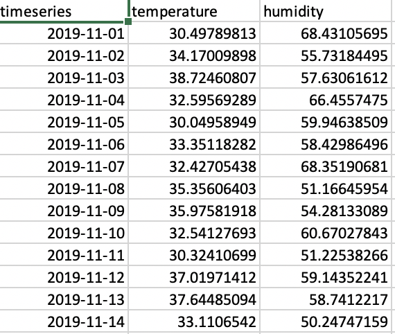
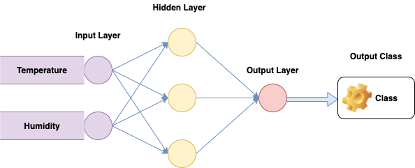
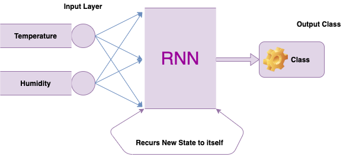

Hello everyone! I hope everyone is having a good time coding!
Well to tell you a little about myself, I’ve made a “small career shift” from Full Stack Development and trying to pursue Data Science. I’m starting from scratch and want to reach the summit while understanding all the particulars of the subject. During this assimilation, I’d be glad if you folks point out any corrections or suggest better ways of doing stuff already mentioned in this article. I hope you all enjoy reading!

## What is sequential data?

Whenever the points in the dataset are dependent on the other points in the dataset the data is said to be Sequential data. A common example of this is a Timeseries such as a stock price or a sensor data where each point represents an observation at a certain point in time.
There are other examples of sequential data like sequences, gene sequences, and weather data.

---

## Why is sequential data an issue for the traditional neural network?

Well, for a fact, the traditional neural networks can’t typically handle these types of data well. So let’s see why can’t we use feedforward neural networks to analyze sequential data.
Let’s consider a sequential problem to see how well suited basic neural network might be. Suppose we have a sequence of data that contains temperature and humidity value every day.
Our goal is to build a neural network that imports the temperature and humidity values of a given day as input and output. For instance, to predict the weather for that day is sunny or rainy. This is a straightforward task for a traditional feedforward neural network.

Using our dataset, we first feed a data point into the input layer. The data then flows into the hidden layer or layers where the weights and biases are applied. Then the output layer classifies the result from the hidden layer, which ultimately produces the output of sunny or cloudy or rainy weather.
Of course, we can repeat the steps for the second day and get the results. However, it is important to know that the model is stateless, it does not remember the data that it just analyzed. All it does it to take input after input and produce an individual classification for every day.

In fact, a traditional neural network assumes the data is non-sequential, and that each data point is independent of other data points. As a result, the inputs are analyzed in isolation, which can cause problems in case there are dependencies in the data.
To see how this can be a limitation, let’s go back to the weather example again. As you can imagine when examining weather, there is often a strong correlation of the weather on one day having a strong influence on the weather on the subsequent days. That is if it was sunny on one day in the middle of the summer, it’s not unreasonable to presume that it’ll also be sunny the following day. A traditional neural network model does make use of this information, however, so we’d have to turn to a different type of a model like a **Recurrent Neural Network** model.

A **Recurrent Neural Network** or the **RNN** has a mechanism that can handle the sequential dataset. This is also the gist of the problem that the recurrent neural network is trying to address

Follow Me
Guys, if you liked reading this article and want to read more and follow my journey along into being a well informed Data Scientist, please follow me here on [Medium](https://medium.com/@aashishchaubey), [Twitter](https://twitter.com/AashishLChaubey) and [LinkedIn](https://www.linkedin.com/in/chaubey-aashish/). Also please do not forget to leave your comments for this article!